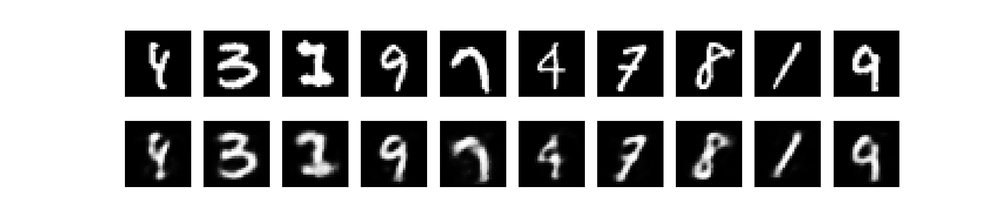

# autoencoders_using_numpy
Implementation of an autoencoder (and denoising autoencoder) for image reconstruction using numpy.



## Requirements
* Python 3.5
* To install the list of dependencies, run:
`pip install -r requirements.txt`

## How to run
* To train an autoencoder, run:

```
$ python autoencoder.py --lr 0.2 --momentum 0.9 --regularizer 0.001 --mini-batch-size 100 --epoch 20
```

* To train a denoising autoencoder, run:

```
$ python autoencoder.py --lr 0.2 --momentum 0.9 --regularizer 0.001 --mini-batch-size 100 --epoch 20 --denoising
```

* In order to train an MLP classifier with unsupervised pretraining using the decoder on the MNIST dataset, run: 
```
$ python autoencoder.py --lr 0.2 --momentum 0.9 --regularizer 0.001 --mini-batch-size 100 --epoch 20 --denoising --train_classifier
```


## Contact
* Hadi Salman: hadicsalman at gmail.com


